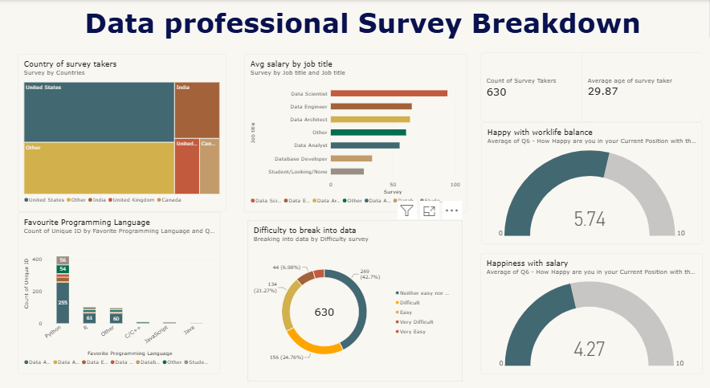

#  Data Professional Survey Analysis – Power BI

##  Project Overview

This project is an interactive **Power BI dashboard** created to analyze survey data from data professionals.

The dashboard provides insights into job roles, salaries, programming languages, countries, job satisfaction, work-life balance, and the difficulty of entering the data field.

##  Objectives

* Analyze different job roles in the data industry.
* Compare average salaries across different job titles.
* Identify the most popular programming languages.
* Analyze the countries represented by survey participants.
* Understand salary and work-life balance satisfaction.
* Explore the difficulty of entering the data field.
* Present the findings using interactive Power BI visualizations.

##  Dataset

The dataset contains survey responses from **630 data professionals** with **28 attributes**.

The dataset includes information such as:

* Job Title
* Salary
* Industry
* Country
* Programming Language
* Education
* Gender
* Age
* Work-Life Balance Satisfaction
* Salary Satisfaction
* Difficulty of Entering the Data Field

##  Tools Used

* **Microsoft Power BI**
* **Power Query**
* **Microsoft Excel**
* Data Cleaning
* Data Analysis
* Data Visualization

##  Dashboard Features

The dashboard includes visualizations for:

*  Total Survey Takers
*  Average Age
*  Average Salary by Job Title
*  Favorite Programming Languages
*  Country Distribution
*  Work-Life Balance Satisfaction
*  Salary Satisfaction
*  Difficulty of Breaking into the Data Field

##  Key Analysis

The dashboard helps answer questions such as:

* Which data-related jobs have higher average salaries?
* Which programming languages are most preferred?
* Where are the survey participants located?
* How satisfied are data professionals with their salaries?
* How satisfied are they with their work-life balance?
* How difficult do people find entering the data profession?

##  Dashboard Preview

##  Skills Demonstrated

This project demonstrates skills in:

* Data Cleaning
* Data Transformation
* Data Analysis
* Data Visualization
* Dashboard Design
* Power BI
* Power Query
* Excel
* Business Intelligence

## 📌 Conclusion

The Power BI dashboard provides an interactive overview of the data professional landscape. It helps identify patterns in salaries, job roles, programming languages, geographical distribution, and professional satisfaction.

